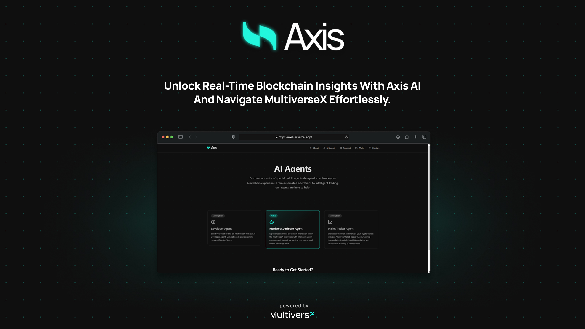
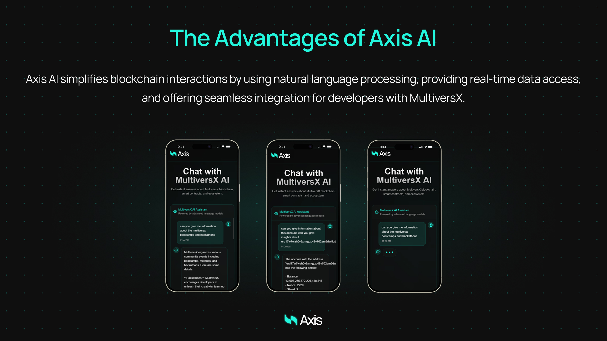

# Axis Agent 🤖

<div align="center">
  
  <br>
  <strong>AI-Powered Access to MultiversX Blockchain</strong>
</div>


## 🌟 Overview

Axis Agent is an AI-powered assistant providing real-time access to the MultiversX blockchain network. Users can check account balances, view transaction history, and analyze network status using natural language queries. It also makes blockchain development more efficient by providing seamless access to MultiversX API and SDK documentation.


## 📦 Project Repositories

- **Main Application**: [axisagent](https://github.com/alperenbekci/axisagent) - Contains the AI-powered chat application
- **Hackathon Project**: [Xperience-hackathon-axis](https://github.com/mericcintosun/Xperience-hackathon-axis) - Original hackathon submission
- **Axis Agent**: [axis](https://github.com/alperenbekci/axis) - Main repository containing all project components

## 🔗 Live Demos

- Landing Page: [https://axis-ai.vercel.app/](https://axis-ai.vercel.app/)
- AI Chat: [https://axisagent.vercel.app/](https://axisagent.vercel.app/)


## 🤔 Why Axis Agent?

Accessing blockchain data is often complex and requires technical expertise. Users struggle with blockchain explorers to check accounts, track transactions, and analyze network health. Developers face inefficiencies due to scattered and complex documentation.

Axis Agent simplifies this process using Natural Language Processing (NLP) and an AI-powered query engine, allowing users to effortlessly access blockchain insights through simple text commands.

## 🚀 Key Features

<div align="center">
  
  <br>
  <strong>AI-Powered Access to MultiversX Blockchain</strong>
</div>


- **Natural Language Processing (NLP)**: Execute complex blockchain queries with simple text commands
- **Real-Time Data Access**: Get instant account balances, transaction history, and network status
- **Developer Support**: Direct access to MultiversX API and SDK resources
- **AI-Powered RAG Model**: Retrieves the most up-to-date information from MultiversX public APIs and documentation
- **Seamless Integrations**: Can be used as a chatbot on platforms like Telegram and Discord

## 📁 Project Structure

```
📦 axis/
 ┣ 📂 axisagent/     # AI-powered assistant application
 ┗ 📂 landingpage/   # Axis Agent landing page content
```

Each folder has its own installation and usage documentation.

## ⚙️ Installation

For detailed installation instructions, check the relevant documentation:

- [Axis Agent Setup](./axisagent/README.md)
- [Landing Page Setup](./landingpage/README.md)

## 🔮 Future Plans

Axis Agent aims to evolve with more advanced AI agent models and enable broader use cases:

- AI Agents for Managing DeFi Protocols
- Automated Trading Bots for Blockchain Transactions
- AI-Powered Wallet Management Tools
- Multi-Blockchain Integrations for Wider Accessibility

## 💰 Tokenomics

Axis AI will use a utility token to support transaction fees, incentivize users, and increase ecosystem participation. The token will:

- Be used for processing transactions within the platform
- Reward users and incentivize participation within the ecosystem
- Provide incentives to developers integrating with Axis AI

## 📄 License

This project is licensed under the MIT License.

## 🤝 Contributing

If you'd like to contribute, please check out [CONTRIBUTING.md](./CONTRIBUTING.md).

## 📞 Contact

- Website: [https://axis-ai.vercel.app/](https://axis-ai.vercel.app/)
- Twitter: [@AxisAgent](https://twitter.com/AxisAgentX)
- Email: info.axisai@gmail.com